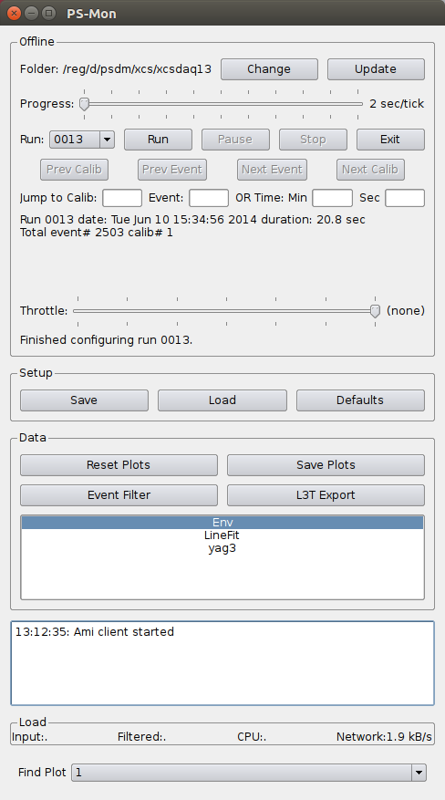
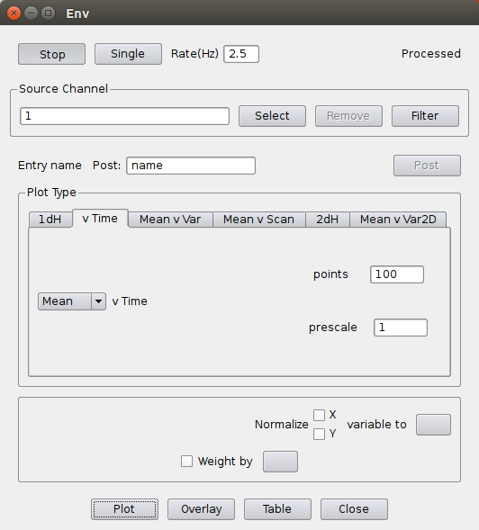
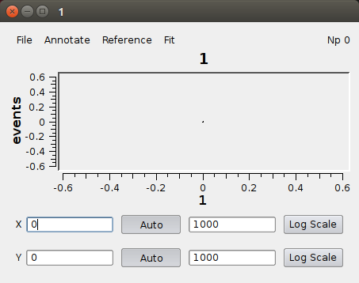
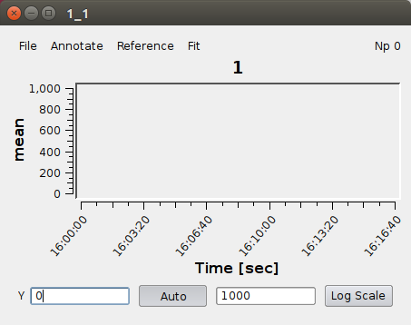
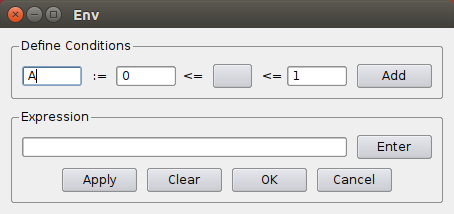
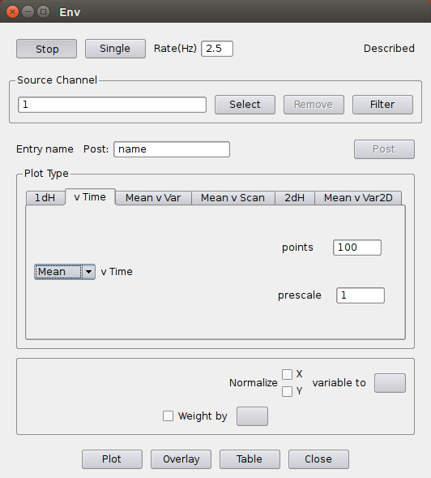
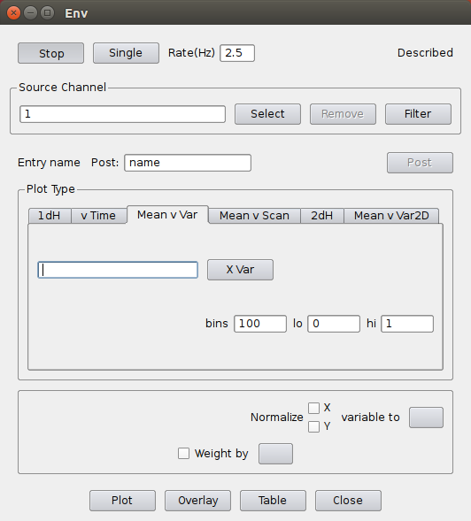
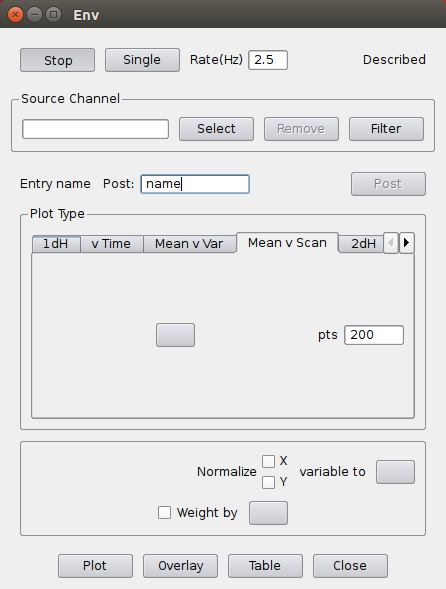
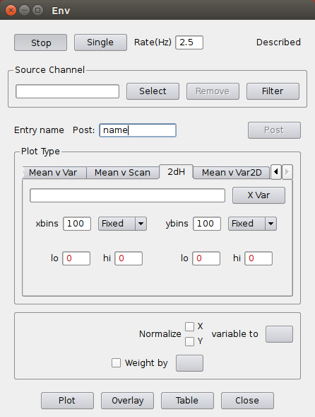
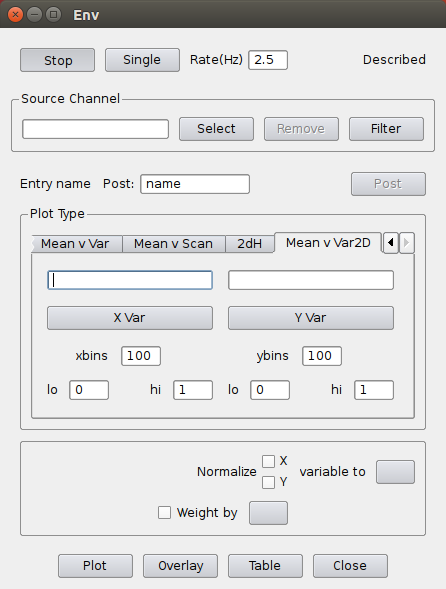

## existing AMI Clients

This page documents the existing clients from AMI-1.

### PS-Mon

The initial UI lets the user choose from among several data sources
(Env, LineFit, yag3).

It also provides session control
(Folder, Progress, Run, Throttle, Setup, Data, Find Plot).
TODO: explain session control.

### Env

The Env data source supports one of six modes for displaying data
(1D histogram, v Time, Mean v Var, Mean v Scan, 2D histogram, Mean v Var2D).
All of these modes support "Normalize" and "Weight by" as shown.

All of the modes produce a small x-y plot like this one for the 1D histogram.

Here is a plot from the "v Time" mode, it is similar to the 1D histogram plot.

We can apply a filter to the data source like this.

The only difference among these modes is the selection in the "Plot type" region.

