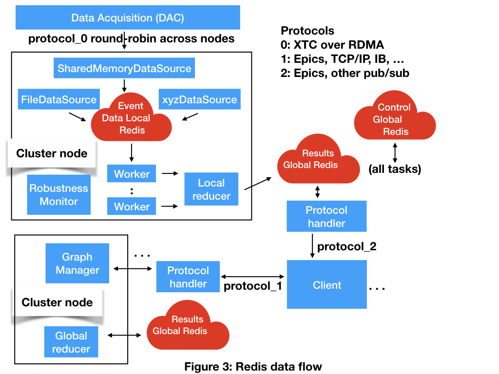

# Generic design

In the generic design all of the components are separate processes.
The stores are implemented by a distributed resilient in-memory database like Redis.
A local Redis runs privately on each node to support telemtry processing.
A global distributed Redis runs across the cluster to provide data to clients and control.

Telemtry is provided from a data source to the local Redis.
Workers subscribe to channels from the local Redis.
When a worker gets a frame of telemtry it checks the global Redis to see if there is a new computation graph.
If there is a new graph the worker compiles it.
Then the worker runs the computation graph on the telemetry frame.
The worker writes the results to the global Redis.

The graph manager waits for requests from clients over protocol 1.
A request consists of a list of modifications to the computation graph, a list of desired results, or both.
When a request arrives the graph manager checks it for validity.
If the request is valid the graph manager 
assembles a new computation graph and
writes it to the global Redis.

The robustness monitor listens for a regular heartbeat from every other process.
If there are multiple robustness monitors running in the system they monitor each other.
If a process goes down the robustness monitor on that node will notice and restart it.
When the process restarts it will reload its volatile state from the global Redis and resume where it left off.

