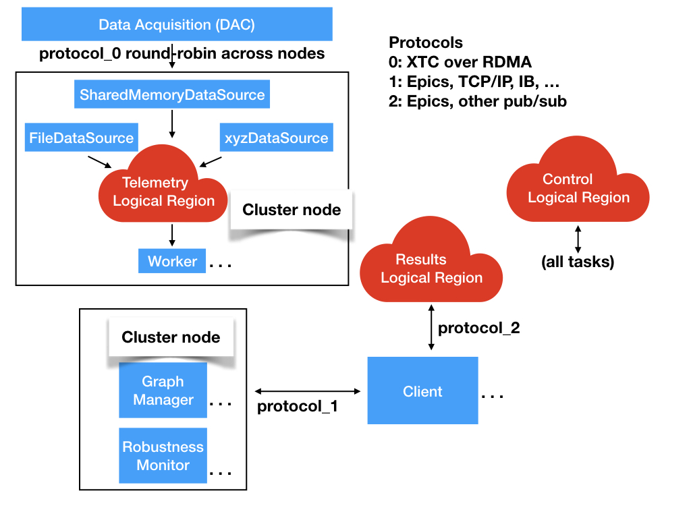
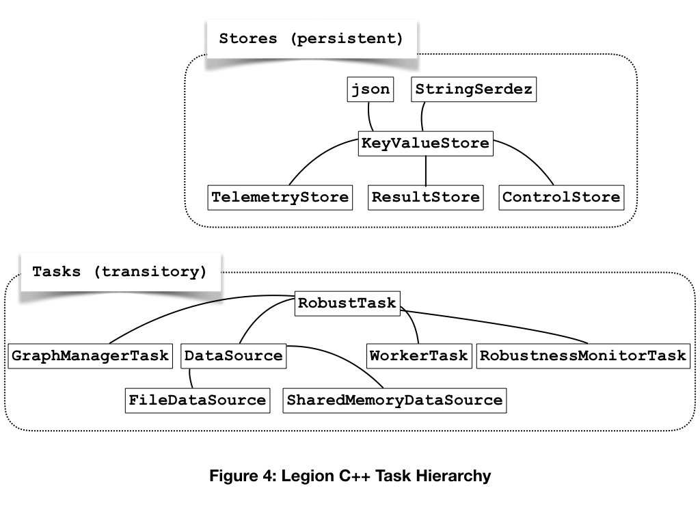

# Legion design

 
In the Legion design all of the components are Legion tasks except for the clients.
The stores are Legion logical regions.
The regions implements a [key-value store for JSON data](key_value_lr.md).

A custom mapper ensures that data sources and workers are mapped together on cluster nodes.
The telemetry logical region is partitioned across the cluster nodes.
The Graph Manager and Robustness Monitors are mapped onto one or more additional cluster nodes.

Legion resilience mechanisms ensure that tasks always complete.
Logical Regions are persisted to disk automatically and reloaded upon restart.
A system cron job ensures that Legion is always running.

## Event flow

The system is event driven and has no central thread of control.
Interactions between components are accomplished through data passed in logical regions and by futures.

### Class hierarchy

A data source task waits for telemetry data to become available.
When data arrives the data source writes it to the telemetry local region.
It updates the Control logical region with changed volatile state and exits returning a future.

The future triggers a worker task.
The worker task first checks the Control logical region for a new computation graph.
If there is a new graph the worker compiles it.
The worker runs the compiled computation graph over the telemetry data.
It writes the results to the Results logical region.

The graph manager waits for requests from clients over protocol 1.
A request consists of a list of modifications to the computation graph, a list of desired results, or both.
When a request arrives the graph manager checks it for validity.
If the request is valid the graph manager 
assembles a new computation graph and
writes it to the Control logical region.

Clients are separate processes that interact with the rest of the system through protocol libraries.
Since these processes are not Legion tasks they cannot directly read or write logical regions.
The details of the coupling between Legion tasks and client processes remain to be determined, and
may be as simple as sockets.

