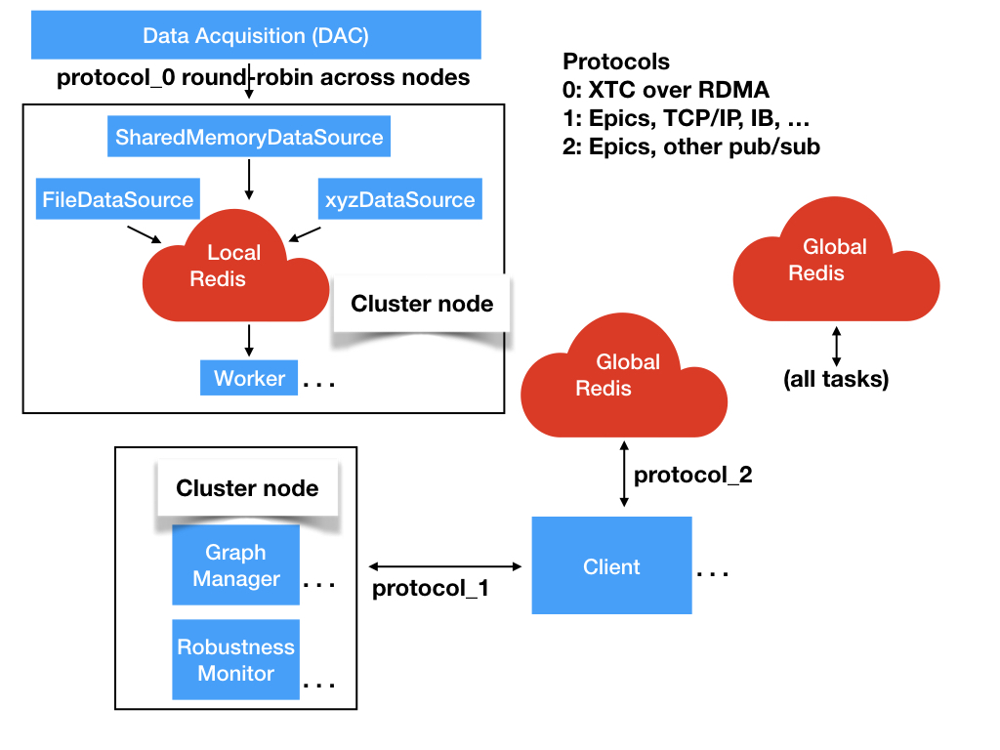

# Redis design

In the Redis design all of the components are separate processes.
The stores are implemented by the distributed resilient in-memory database Redis.
A local Redis runs privately on each node to support telemtry processing.
A global distributed Redis runs across the cluster to provide data to manage Control and Results.

Telemetry data is provided from a data source to the telemetry Redis.
Workers subscribe to channels from the telemetry Redis.
When a worker gets a telemetry frame it checks the Control Redis to see if there is a new computation graph.
If there is a new graph the worker compiles it.
Then the worker runs the computation graph on the telemetry frame.
The worker passes the results to a Collector.

Collectors filter and buffer output from the workers and write the results to the Result store.
Collectors execute a collector graph that is similar to the computation graph.
Collectors reduce the data rate to the Heartbeat Rate that is suitable for display on clients.

The graph manager waits for requests from clients over protocol 1.
A request consists of a list of modifications to one of the graphs, a list of desired results, or both.
When a request arrives the graph manager checks it for validity.
If the request is valid the graph manager 
assembles a new graph and
writes it to the
Control Redis.

The robustness monitor listens for a regular heartbeat from every other process.
If there are multiple robustness monitors running in the system they monitor each other.
If a process goes down the robustness monitor on that node will notice and restart it.
When the process restarts it will reload its volatile state from the Control Redis and resume where it left off.

