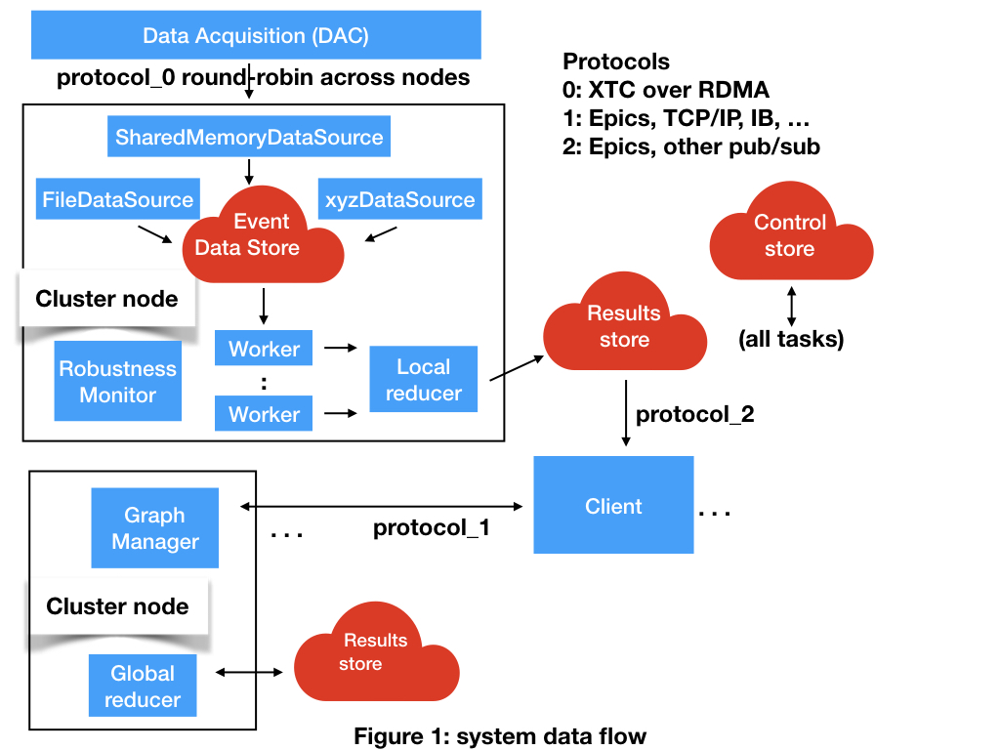

# Overview

AMI2 is a distributed visualization system for use with LCLS-II Free Electron Laser.
It is a rewrite of the previous AMI package.

## Data flow
Please see the System Diagram below.

Frames of instrument telemetry enter the system through a Data Source.
At SLAC the SharedMemoryDataSource receives telemetry from the Data Acquisition system delivered by RDMA.
A FileDataSource drives the system in offline mode.
The system can be extended with new data sources (e.g. xyzDataSource).

The Redis distributed key-value store is used for communication among processes and to implement fault tolerance and fail over.
A local Redis partition exists on every cluster node, while a Global Redis partition supports fail-over and sends data for consumption by clients.

Each telemetry frame is processed by a different worker.
Each cluster node may support multiple workers.
The cluster can be scaled to support arbitrarily high data rates.

A worker processes a telemetry frame by feeding the data to a Computation Graph which is a series of transformations.
The computation graph is defined by the Graph Manager according to requests from clients.
It is implemented as a python program that is assembled and optimized by the Graph Manager.
The result of a worker computation is stored in the Global Redis.

The Feature Store provides access to worker computations in the Global Redis.
It uses the Redis publish/subscribe protocol.
It supports buffering over time for strip chart recording.

Clients may be GUIs, devices, or file proxies.
Clients requests computations from the Graph Manager and subscribe to result channels from the Feature Store.

## System Diagram

### Data Acquisition (DAC)
Data delivery events from sensors, distributed round-robin to nodes via Infiniband RDMA.

### DataSource
[DataSources](data_source.md) provide telemetry data to the system.
#### SharedMemoryDataSource
Transfers incoming sensor data to the local Redis.
#### FileDataSource
Replays sensor data stored in a file.
#### xyzDataSource
User extended data source

### Worker
[Worker processes](worker.md) perform computation on the data and place the results in the global Redis.

### Graph Manager
[Graph manager process](graph_manager.md) manipulates and optimizes the computation graph.
May be replicated (not distributed) in a large scale system.
The graph definition is stored in the global Redis.

### Feature Store
API from which clients can [subscribe to data](feature_store.md).
May be replicated (not distributed) in a large scale system.

###Client
[Client processes](client.md) acquire data for visualization or control.
#### GUI Client
Python/Qt client process that sends requests to the Graph Manager and receives data from Feature store.
#### Device Client
Clients may play other roles such as device controllers.

###Protocol handlers
Communication between the clients, GraphManager and FeatureStore occurs over a [modular protocol](protocol.md).
#### Epics protocol
The Experimental Physics and Industrial Control System (EPICS) is a DOE labs protocol.
#### TCP/IP

## Project Goals

Open Source package for Linux with an installer

Robust to node or process failure, recover from crash

Scriptable, can log/control from logs/scripts

Multiple users can simultaneously edit the computation graph (at low rates)

Scalable to clusters of any size including supercomputers

Drive it online from shared memory event mechanism, or offline from a file

Portable, no Psana dependencies (or isolate them), hardware agnostic Linux/IA, any network

Follow well defined coding conventions, good project hygiene and testing

Extensible - new clients, new GUI elements, new Computation Graph operations, new data sources

Two versions, one with Legion and another without

Support Epics protocol to send data to clients, also for clients to make requests

"sum all", "pick 1", "sum 1" style calculations

## First milestone

The first milestone is a generic use case of the most common features, driven from
a canned example.
This will also consitute the first test in a suite of tests.

Starting from scratch, install the software and start it running.
Use an offline data source to drive a standard interaction.
Open a GUI client that acquires 2D sensor image data.
Select a region from the sensor image.
Plot the mean pixel value of this region across time in a strip chart recorder.
Verify the data visualization is corrent.
Shut the system down cleanly.

